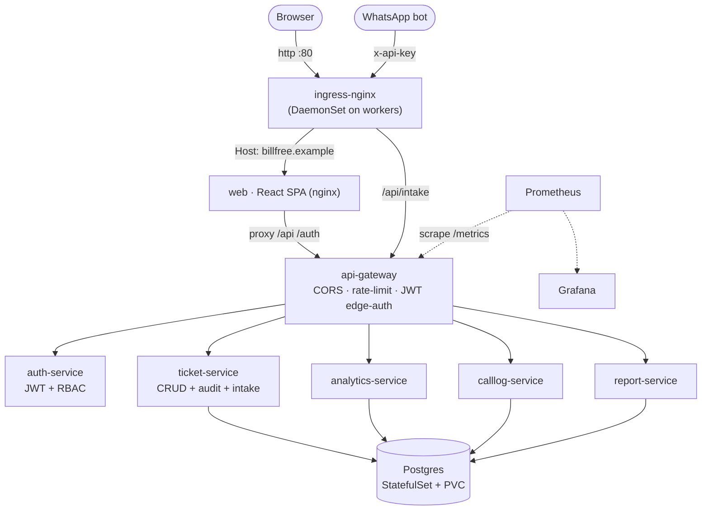
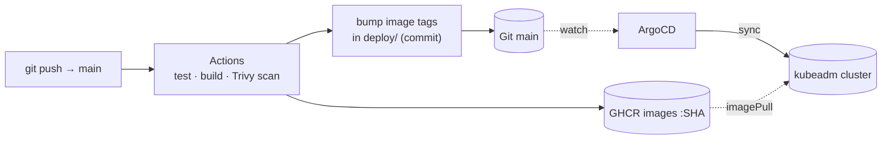

# BillFree TechOps

Tech-support ticketing + analytics for BillFree's POS-integration team — built as a
**cloud-native, microservices DevOps showcase**: a React SPA and six Node/TypeScript
services, containerized and deployed to a **self-managed Kubernetes cluster** with
Terraform · Helm · GitHub Actions · ArgoCD.

> **Proven live.** This stack has been provisioned end-to-end on AWS (a self-managed
> `kubeadm` cluster on EC2), served real data through the gateway, and authenticated
> a dashboard login — then torn down and re-provisioned a second time with
> `terraform destroy` / `terraform apply`. The exact deploy flow, including the
> thirteen real bugs hit and fixed across both runs, is in
> [docs/DEPLOYMENT_ARCHITECTURE.md](docs/DEPLOYMENT_ARCHITECTURE.md).

> Origin story: the platform began as a React SPA + a modular Google Apps Script
> backend (kept under `apps/gas` as the documented legacy origin), then was
> re-platformed onto microservices via the strangler-fig pattern. One env flag
> (`VITE_BACKEND`) switches the SPA between the two.

---

## Architecture



**Delivery is pull-based GitOps** — the only path to production is a commit:



Every request: `web → api-gateway (CORS, rate-limit, JWT) → service (re-verifies JWT)
→ Postgres`. The SPA, gateway, and services agree on statuses / error codes / actions
via `packages/shared` (enforced by a contract test).

---

## Monorepo layout

| Path | What | Stack |
| --- | --- | --- |
| `services/api-gateway` | Edge: CORS, rate-limit, JWT, reverse-proxy, public intake | Fastify, http-proxy |
| `services/auth-service` | JWT issuer + RBAC directory | Fastify, jose |
| `services/ticket-service` | Ticket CRUD + **audit trail** + **WhatsApp intake** (auto-assign) | Fastify, zod, Postgres |
| `services/analytics-service` | Read-only analytics (status, top-POS, leaderboard) | Fastify, Postgres |
| `services/calllog-service` | Call/CDR event log (role-scoped) | Fastify, Postgres |
| `services/report-service` | Monthly operations report (computed from tickets) | Fastify, Postgres |
| `packages/service-common` | Shared lib: config, logging, errors, db, JWT + API-key auth, metrics, health | TypeScript |
| `packages/shared` | Cross-cutting contract (statuses, error codes, API actions) | TypeScript |
| `apps/web` | React SPA dashboard (nginx container) | React 18, Vite, Zustand, Recharts |
| `db/` | Tracked, transactional SQL migrations + runner image | Node, pg |
| `infra/terraform` | Self-managed kubeadm cluster on EC2 (cloud-init, Calico) | Terraform |
| `deploy/charts/microservice` | Reusable Helm chart (Deployment/Service/HPA/PDB/ServiceMonitor/Ingress) | Helm |
| `deploy/apps`, `deploy/platform` | Per-service Helm values; in-cluster Postgres/Redis/migrate | YAML |
| `deploy/argocd` | App-of-apps GitOps root + Applications + addons | ArgoCD |
| `.github/workflows` | CI (test matrix) + Build/Deploy (GHCR + GitOps bump) | GitHub Actions |
| `scripts/` | `fetch-kubeconfig.sh`, `bootstrap-cluster.sh` | Bash |
| `apps/gas` | Original modular Google Apps Script backend (legacy origin) | Apps Script |

---

## Quickstart — local, no cloud

```bash
nvm use && npm install
npm test                       # 170+ tests across all workspaces

docker compose up --build      # full stack: postgres + 6 services + gateway + web
# web → http://localhost:3000      gateway → http://localhost:8080

# Login — token is delivered as an httpOnly cookie (bt_token), never in the body:
curl -sc cookies.txt localhost:8080/auth/token -H 'content-type: application/json' \
  -d '{"email":"admin@billfree.in"}'          # → { data: { user: { email, name, role } } }

# Subsequent requests send the cookie automatically:
curl -sb cookies.txt localhost:8080/api/tickets
```

With no `VITE_GAS_URL`, the SPA also runs fully offline on built-in mock data
(`npm run dev --workspace apps/web` → http://localhost:5173).

---

## Deploy to the self-managed cluster

```bash
# 1. provision (1 control-plane + 2 workers, kubeadm + Calico)
cd infra/terraform && cp terraform.tfvars.example terraform.tfvars   # lock CIDRs to your IP
terraform init && terraform apply

# 2. point kubectl at the cluster
../../scripts/fetch-kubeconfig.sh
export KUBECONFIG="$PWD/kubeconfig"

# 3. one-command bootstrap — storage → secret → ArgoCD → app-of-apps
../../scripts/bootstrap-cluster.sh
```

ArgoCD then reconciles the whole stack from Git. Open `http://<worker-ip>` and log
in as `admin@billfree.in`. Full runbook: **[docs/DEPLOYMENT.md](docs/DEPLOYMENT.md)** ·
flow + field notes: **[docs/DEPLOYMENT_ARCHITECTURE.md](docs/DEPLOYMENT_ARCHITECTURE.md)**.

```bash
terraform -chdir=infra/terraform destroy        # tear down, stop billing
```

---

## Quality gates

- **CI** (`ci.yml`): shared contract → GAS tests → service-common → 6 services
  type-check/test → web type-check/lint/test/build. **156 tests.**
- **Build & Deploy** (`build-deploy.yml`): per-image Docker build + Trivy scan +
  push to GHCR, then commit the new image tags so **ArgoCD** rolls them out
  (pull-based GitOps — CI never touches the cluster).
- Containers: multi-stage, non-root, hardened `securityContext`, HPA + PDB + probes.
- Secrets: only `.env.example` is tracked; runtime secrets come from a bootstrap
  K8s Secret / CI secrets — never from Git.

---

## Docs

- [docs/DEPLOYMENT_ARCHITECTURE.md](docs/DEPLOYMENT_ARCHITECTURE.md) — deployment flow, diagrams, field notes
- [docs/DEPLOYMENT.md](docs/DEPLOYMENT.md) — cloud-native deploy runbook
- [docs/ARCHITECTURE.md](docs/ARCHITECTURE.md) — system design (both architectures)
- [docs/WHATSAPP_INTAKE.md](docs/WHATSAPP_INTAKE.md) — external chatbot intake API
- [services/README.md](services/README.md) · [apps/web/README.md](apps/web/README.md) · [apps/gas/README.md](apps/gas/README.md) · [packages/shared/README.md](packages/shared/README.md)
- [CONTRIBUTING.md](CONTRIBUTING.md)
