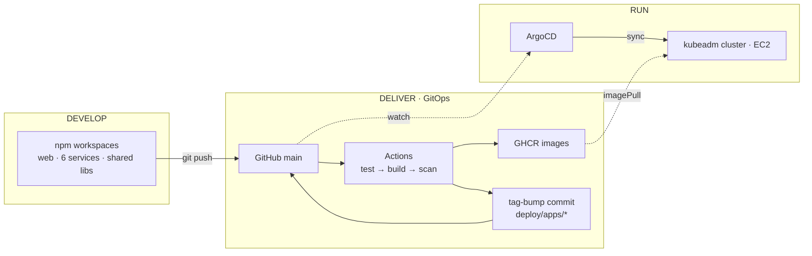
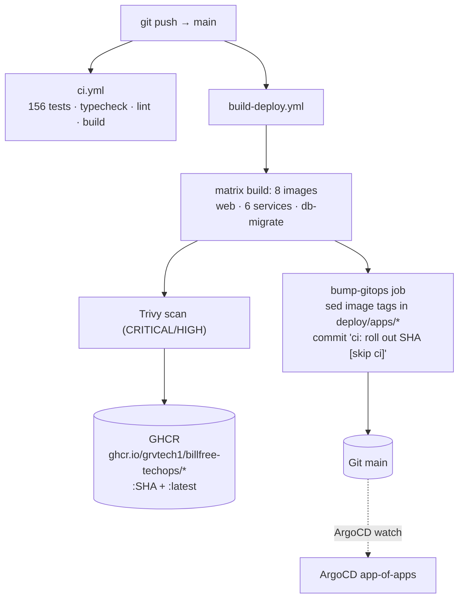
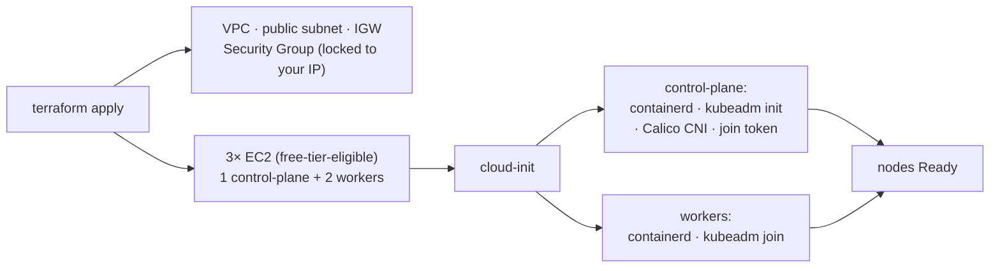
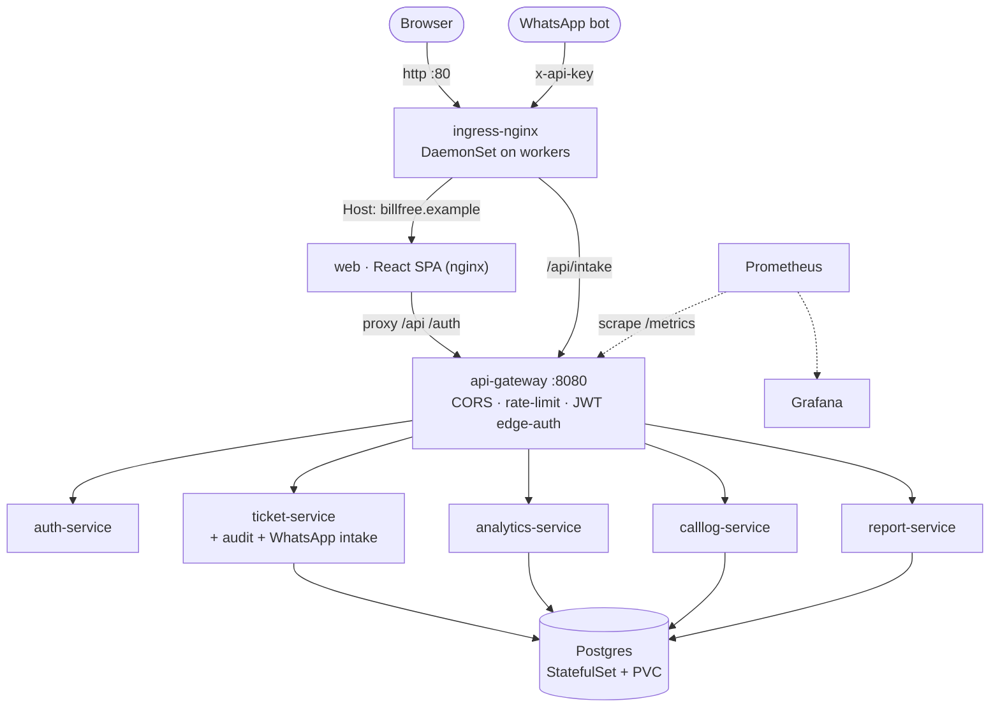
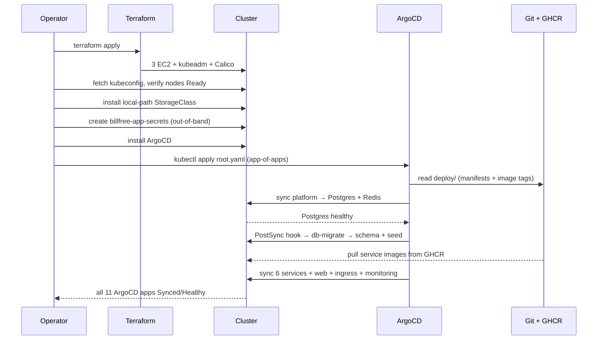

# Deployment Architecture & Flow

How BillFree TechOps goes from a developer's commit to running pods on a
**self-managed Kubernetes cluster on AWS** — and how it was actually deployed
(including the real failures hit along the way).

The system is delivered across **three planes connected only by Git**. No human
and no CI job ever runs `kubectl` against the cluster — the single path into
production is a commit to `main`. This is pull-based GitOps.

---

## 0. At a glance — three planes



| Plane | Owns | Tooling |
| --- | --- | --- |
| **Develop** | source, tests, contracts | npm workspaces, Vitest, tsup, Vite |
| **Deliver** | images + desired-state in Git | GitHub Actions, Trivy, GHCR |
| **Run** | reconcile Git → cluster | ArgoCD, Helm, Kubernetes |

The planes never call each other directly. Delivery writes images to a registry
and a desired image-tag to Git; Run watches Git. That seam is what makes rollbacks
a `git revert` and keeps CI credentials out of the cluster.

---

## 1. Delivery pipeline — commit to image to desired-state



- **Every push to `main`** triggers both workflows. `ci.yml` gates correctness;
  `build-deploy.yml` builds, scans, pushes, then **commits the new image tags back
  to `main`** (`deploy/apps/<svc>/values.yaml`).
- The bump commit carries **`[skip ci]`** so it never re-triggers itself (no loop).
- Images are tagged with the **commit SHA** (immutable) — so a given Git state maps
  to exactly one set of images. Rollback = revert the bump commit.

---

## 2. Infrastructure — self-managed Kubernetes (kubeadm, **not** EKS)



Terraform stands up the raw cloud (VPC, EC2, firewall, SSH key) and hands each node
a **cloud-init** script that bootstraps the Kubernetes control plane / workers with
`kubeadm` + Calico. The result is a vanilla, fully self-managed cluster — you own
etcd, the API server, the upgrade path, everything. 14 resources total.

---

## 3. Runtime topology & request flow



- **One ingress, host-routed.** The SPA's own nginx proxies `/api` + `/auth` to the
  gateway in-cluster, so the browser only needs the web host.
- **Defense in depth:** the gateway authenticates the JWT at the edge **and** each
  service re-verifies it. The public WhatsApp intake path uses an **API key** (not a
  user JWT) on a separate route.
- **Stateful core:** a single Postgres StatefulSet backs all data services; a
  `local-path` provisioner satisfies its PVC (a bare kubeadm cluster has no default
  StorageClass — see field notes).

---

## 4. First-deploy bootstrap sequence



The only manual steps are the **bootstrap** ones (provision, kubeconfig, the
out-of-band secret, install ArgoCD, apply the root app). Everything after
`root.yaml` is reconciled by ArgoCD from Git — including ordering: the **PostSync
migrate hook** runs only after Postgres is healthy, so the schema is always applied
before the services that depend on it.

---

## 5. Field notes — what actually broke (and the fix)

Real issues hit during the first live deploy. These are the difference between a
diagram and a running system.

| # | Symptom | Root cause | Fix |
| --- | --- | --- | --- |
| 1 | CI "startup failure", `(Unnamed workflow)` | `aquasecurity/trivy-action@0.24.0` — version doesn't exist; GitHub resolves all `uses:` at startup | pin to `@master` |
| 2 | `RunInstances … not eligible for Free Tier` | account restricted to free-tier instance types | switch to free-tier-eligible `c7i-flex.large` / `m7i-flex.large` |
| 3 | SSH to nodes times out | `checkip` reported a different IP than the real egress (CGNAT) | open SG to real IP / widen temporarily |
| 4 | `kubectl` TLS error: cert valid for `10.x`, not public IP | kubeadm apiserver cert SAN excludes the public IP | `insecure-skip-tls-verify` for remote admin (or add `--apiserver-cert-extra-sans`) |
| 5 | Postgres PVC `Pending` forever | bare kubeadm has **no default StorageClass** | install Rancher `local-path-provisioner`, mark default |
| 6 | All pg-using services `CrashLoopBackOff`:<br/>`Dynamic require of "events" not supported` | tsup bundled CommonJS `pg` into ESM; its `require()` fails at runtime (tests never run the bundled artifact) | add `createRequire` banner to tsup configs |
| 7 | `web` crash: `mkdir /var/cache/nginx … denied` | chart's non-root securityContext merged `runAsUser:1000`; stock nginx can't write cache | `runAsUser: 0` for web |
| 8 | `platform` stuck, Postgres never deploys | migrate was a **PreSync** hook needing Postgres from the same app → deadlock | change hook to **PostSync** |
| 9 | Dashboard login hangs at "Signing in…" | web nginx proxies `api-gateway:8080`, but the K8s Service exposed `:80` | set gateway Service port to `8080` |

Bugs 6–9 were fixed in code and rolled out **through the same GitOps pipeline**
(commit → CI → ArgoCD), proving the loop end-to-end rather than hand-patching pods.

---

## 6. Teardown

```bash
cd infra/terraform
terraform destroy -auto-approve   # removes all 14 resources, stops billing
```

GitOps state (Git, GHCR images) survives teardown — a fresh `terraform apply` +
the bootstrap sequence reproduces the identical running system from `main`.

---

## See also
- [DEPLOYMENT.md](DEPLOYMENT.md) — the step-by-step runbook
- [ARCHITECTURE.md](ARCHITECTURE.md) — application/system architecture
- [../services/README.md](../services/README.md) — the microservices
- [WHATSAPP_INTAKE.md](WHATSAPP_INTAKE.md) — the external chatbot API
